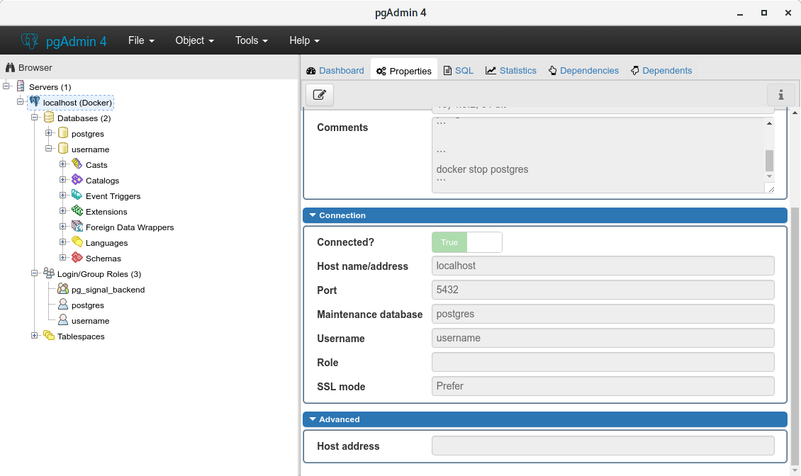

Gerade bin ich über einen [super Blog Post][blog] gestolpert der mir wieder gezeigt hat wie toll [Docker][docker] ist.
In dem [Blog][blog] beschreibt der Author wie er mit Hilfe von [Docker][docker] eine Postgres Datenbank startet. Diese Postgres Datenbank steht dann unter dem Standard PostgreSQL Port 5432 unter localhost anderen Anwendungen zur Verfügung. Ganz so als hättet ihr die Postgres Datenbank lokal auf eurem System installiert.

Die Datenbank ist aber nicht lokal auf eurem System installiert. Sie wird mit [Docker][docker] in einem [Container][docker-container] (eine virtuelle Umgebung) gestartet. [Docker][docker] kümmert sich dann darum das die Anfragen in diese virtuelle Umgebung geleitet werden.

Lange Rede kurzer Sinn.... Lasst den Code sprechen :)

```bash
docker run --rm --detach --name postgres --env POSTGRES_USER=username --env POSTGRES_PASSWORD=password --publish 127.0.0.1:5432:5432 postgres
```
Dieser Befehl startet docker. Der letzte Parameter `postgres` ist das so genannte IMAGE welches Docker startet. Ein IMAGE ist ein komplettes Linux mit installierten und konfigurierten Anwendungen, in diesem Fall halt Postgres.

Der Parameter `--rm` sorgt dafür, dass wenn dieser laufende [Docker][docker] [Container][docker-container] beendet wird, alle Dateien gelöscht werden. **Achtung das zeigt das dieser Befehl wirklich nur für die Entwicklung und NICHT FÜR PRODUKTION verwendet wird!**

`--detach` lässt den [Container][docker-container] im Hintergrund laufen.

Die `--env` Parameter sind eine Möglichkeit Daten in den [Container][docker-container] zu übertragen. In diesem Fall ein Postgres Benutzer und Password. Der Ersteller des Image hat es so konfiguriert dass wenn diese Daten vorhanden sind, diese automatisch in Postgres eingetragen werden. Das ist aber von Image zu Image unterschiedlich.

Last but not least sorgt der Parameter `--publish` dafür das der locale Port 5432 im [Container][docker-container] nach Außen geleitet wird. Euer locales System besitzt, wenn der [Container][docker-container] läuft, dann unter der Adresse localhost:5432 eine Postgres Datenbank.

Installiert/ Startet doch einfach mal das Tool [**pgAdmin**][pgadmin] und verbindet euch auf auf euer lokales System Port 5432 (localhost:5432).

[](./pgadmin.png)

Beenden kann man die ganze Magie mit dem Befehl:

```bash
docker stop postgres
```

> Wie schon weiter oben gesagt löscht Docker alle Dateien die zur Laufzeit des [Containers][docker-container] erstellt wurden. Eure Daten sind danach weg!

Das Ganze hat den Vorteil das das lokale System völlig unberührt bleibt. Ich meine eine Postgres Datenbank ist jetzt nicht wirklich eine riesen Anwendung, aber wenn ich da an meine letzten Debian Entwicklungssysteme zurück denken, dann hatte ich da immer eine Postgres Datenbank im Hintergrund laufen, die auch bei jedem Reboot gestartet wurde. Und das nur weil ich MAL eine Datenbank brauchte und die dann halt lokal installiert hatte.

**Dieser Blog Post ist nicht als Anleitung von Docker zu sehen. Wenn euch die hier beschriebenen Sachen überhaupt nichts sagen, dann besucht bitte unbedingt die [Docker Webseite][docker] und lest euch in das Thema ein.**


[blog]: https://medium.com/@Buys/grokking-diesel-652cb8886a63
[docker]: https://www.docker.com/what-container
[docker-container]: https://www.docker.com/what-container
[pgadmin]: https://www.pgadmin.org/

